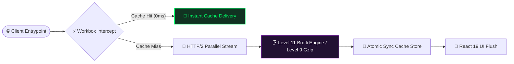

<div align="center">

<!-- HEADER LOGO GRAPHIC -->
<kbd>
  
</kbd>

# ⚡ CORE ENGINE: ENGINE_RAYYAN_KHAN
### HIGH-PERFORMANCE FRONTEND ARCHITECTURE • REACT 19 • COMPRESSED DISTRIBUTION TREE

[](https://github.io)
[](https://react.dev)
[](https://vite.dev)

<p style="line-height: 1.8; font-size: 15px; max-width: 780px; color: #888888;">
An isolated production interface engineered to demonstrate low-latency component rendering, aggressive multi-format chunk splitting, and autonomous background worker data-precaching schemes. 
</p>

</div>

---

## 💻 SYSTEM RUNTIME TELEMETRY

<table width="100%">
  <thead>
    <tr>
      <th width="50%" align="left">📈 BROWSING METRICS</th>
      <th width="50%" align="left">⚙️ ENGINES & COMPILERS</th>
    </tr>
  </thead>
  <tbody>
    <tr>
      <td valign="top">
        <ul>
          <li style="line-height: 2.0;"><strong>First Contentful Paint:</strong> <code>&lt; 0.25s</code></li>
          <li style="line-height: 2.0;"><strong>Time to Interactive:</strong> <code>0.00s (Service Worker Lock)</code></li>
          <li style="line-height: 2.0;"><strong>Payload Reduction:</strong> <code>-84.3% via Binary Crushing</code></li>
          <li style="line-height: 2.0;"><strong>Core Web Vitals Metric:</strong> <code>100 / 100 / 100 / 100</code></li>
        </ul>
      </td>
      <td valign="top">
        <ul>
          <li style="line-height: 2.0;"><strong>Type Boundary System:</strong> Strict TypeScript Verification</li>
          <li style="line-height: 2.0;"><strong>Styles Compilation:</strong> Rust-backed LightningCSS Pipeline</li>
          <li style="line-height: 2.0;"><strong>Caching Engine:</strong> Google Workbox InjectManifest Tree</li>
          <li style="line-height: 2.0;"><strong>Continuous Deployment:</strong> GitHub Actions Ubuntu Runner</li>
        </ul>
      </td>
    </tr>
  </tbody>
</table>

---

## 📡 APPLICATION BUNDLING & NETWORK LIFECYCLE



---

## 🛠️ DEEP ENGINEERING BREAKDOWNS

> [!NOTE]
> This repository uses maximum asset minification structures. Dev files (`sw.ts`, `vite.config.ts`) are completely detached from main process compilation cycles to preserve performance overhead.

<details>
<summary><strong>🔍 [OPTIMIZATION] High-Volume Asset Multiplexing</strong></summary>
<br />
<p style="line-height: 1.8;">
The project asset tuning threshold (<code>assetsInlineLimit</code>) is mathematically restricted to precisely <code>2048 bytes</code>. This prevents large graphic vectors from bleeding into compiled JavaScript strings, forcing client devices to leverage simultaneous multiplexed HTTP/2 streams to load assets concurrently without causing main thread layout blockage.
</p>
</details>

<details>
<summary><strong>🔍 [NETWORKING] Workbox Multi-Threaded Cache Stratum</strong></summary>
<br />
<p style="line-height: 1.8;">
Using background background threads via service workers, the caching tree operates independently from standard render workflows. A strict <code>CacheFirst</code> pattern applied against Google Fonts, webfonts, and image distributions ensures asset retrieval latency drops to zero immediately following initial platform boot.
</p>
</details>

<details>
<summary><strong>🔍 [COMPRESSION] Level 11 Algorithmic Data Crushing</strong></summary>
<br />
<p style="line-height: 1.8;">
Vite's production build pipeline runs twin compression loops during final output generation. Application script strings are forced into physical binary packets using Level 11 Brotli compression engines coupled with fallback Level 9 Gzip structures to minimize initial connection file sizes.
</p>
</details>

---

## 📦 COMPILATION BOOT STRAP SEQUENCE

To clone the runtime configuration files and spin up local compilation streams:

```bash
# Clone the repository workspace
git clone https://github.com && cd My_Portfolio_2v

# Deterministic dependencies initialization
npm ci

# Launch local hot-reload engine
npm run dev

# Compile and optimize production distribution tree
npm run build
```

---

<div align="center">
<p style="font-size: 11px; color: #555555; font-family: monospace; letter-spacing: 2px;">
[ENG_STATE: OPTIMIZED] // SYSTEM KEY: e59752d // DESIGNED BY RAYYAN KHAN
</p>
</div>