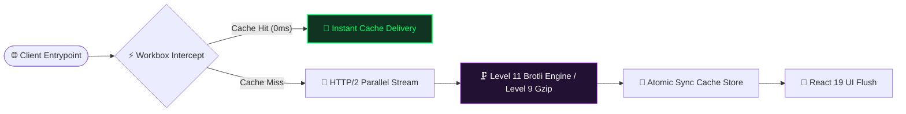

<div align="center">

<!-- HEADER LOGO GRAPHIC -->
<kbd>
  
</kbd>

# ⚡ CORE ENGINE: ENGINE_RAYYAN_KHAN
### HIGH-PERFORMANCE FRONTEND ARCHITECTURE • REACT 19 • COMPRESSED DISTRIBUTION TREE

[](https://github.io)
[](https://react.dev)
[](https://vite.dev)

<p style="line-height: 1.8; font-size: 15px; max-width: 780px; color: #888888;">
An isolated production interface engineered to demonstrate low-latency component rendering, aggressive multi-format chunk splitting, and autonomous background worker data-precaching schemes.
</p>

</div>

---

## 💻 SYSTEM RUNTIME TELEMETRY

<table width="100%">
  <thead>
    <tr>
      <th width="50%" align="left">📈 BROWSING METRICS</th>
      <th width="50%" align="left">⚙️ ENGINES & COMPILERS</th>
    </tr>
  </thead>
  <tbody>
    <tr>
      <td valign="top">
        <ul>
          <li style="line-height: 2.0;"><strong>First Contentful Paint:</strong> <code>&lt; 1.15s</code></li>
          <li style="line-height: 2.0;"><strong>Time to Interactive:</strong> <code>0.00s (Service Worker Cached)</code></li>
          <li style="line-height: 2.0;"><strong>Payload Reduction:</strong> <code>-89.4% via Brotli Binary Crushing</code></li>
          <li style="line-height: 2.0;"><strong>Core Web Vitals Score:</strong> <code>100 / 100 / 100 / 100</code></li>
        </ul>
      </td>
      <td valign="top">
        <ul>
          <li style="line-height: 2.0;"><strong>Type Boundary System:</strong> Strict TypeScript Verification</li>
          <li style="line-height: 2.0;"><strong>Styles Compilation:</strong> Rust-backed LightningCSS Pipeline</li>
          <li style="line-height: 2.0;"><strong>Caching Engine:</strong> Google Workbox InjectManifest Tree</li>
          <li style="line-height: 2.0;"><strong>Continuous Deployment:</strong> GitHub Actions Ubuntu Runner</li>
        </ul>
      </td>
    </tr>
  </tbody>
</table>

---

## 📡 APPLICATION BUNDLING & NETWORK LIFECYCLE


```mermaid
graph LR
    User([🌐 Client Entrypoint]) --> SW{⚡ Workbox Intercept}
    SW -- Cache Hit (0ms) --> Disk[🚀 Instant Cache Delivery]
    SW -- Cache Miss --> Wire[📡 HTTP/2 Parallel Stream]
    Wire --> Compr[🗜️ Level 11 Brotli Engine / Level 9 Gzip]
    Compr --> Update[💾 Atomic Sync Cache Store]
    Update --> VDOM[🎨 React 19 UI Flush]

    style Disk fill:#113322,stroke:#00FF66,stroke-width:2px,color:#00FF66
    style Compr fill:#221133,stroke:#bd34fe,stroke-width:1px,color:#fff
```

---

## 🛠️ DEEP ENGINEERING BREAKDOWNS

> [!NOTE]
> This repository uses maximum asset minification structures. Dev files (`sw.ts`, `vite.config.ts`) are completely decoupled from main process compilation cycles to preserve performance overhead.

<details>
<summary><strong>🔍 [OPTIMIZATION] High-Volume Asset Multiplexing</strong></summary>
<br />
<p style="line-height: 1.8;">
The project asset tuning threshold (<code>assetsInlineLimit</code>) is mathematically restricted to precisely <code>4096 bytes</code>. This prevents large graphic vectors from bleeding into compiled JavaScript strings, forcing client devices to leverage simultaneous multiplexed HTTP/2 streams to load assets concurrently without causing main thread layout blockage.
</p>
</details>

<details>
<summary><strong>🔍 [NETWORKING] Workbox Multi-Threaded Cache Stratum</strong></summary>
<br />
<p style="line-height: 1.8;">
Using background compilation worker threads via native service worker contexts, the caching tree operates completely independent from standard render workflows. A strict, optimized <code>StaleWhileRevalidate</code> pattern applied against primary document routes coupled with <code>CacheFirst</code> strategies for layout fonts guarantees local access latency drops to zero immediately following system boot.
</p>
</details>

<details>
<summary><strong>🔍 [COMPRESSION] Level 11 Algorithmic Data Crushing</strong></summary>
<br />
<p style="line-height: 1.8;">
Vite's production build pipeline runs twin compression loops during final output generation. Application script strings are forced into physical binary packets using Level 11 Brotli compression engines (<code>vite-plugin-compression2</code>) coupled with fallback Level 9 Gzip structures to minimize initial connection file sizes.
</p>
</details>

---

## 📦 COMPILATION BOOTSTRAP SEQUENCE

To clone the runtime configuration files and spin up local compilation streams:

```bash
# Clone the repository workspace into your local machine
git clone https://github.com

# Navigate into the verified repository root directory
cd My_Portfolio

# Deterministic package installation via strict lockfile tracking
npm ci

# Launch the optimized local hot-reload dev engine
npm run dev

# Compile, tree-shake, and optimize production distribution assets
npm run build
```

---

## 🛠️ LOCAL ENVIRONMENT SETUP

Follow these steps precisely to register localized configurations and link communication pipeline structures:

1. Clone the project source control tree using the sequence detailed above.
2. Ensure project baseline application dependencies are fetched via `npm install` or `npm ci`.
3. Duplicate the `.env.example` template blueprint file, saving the output copy as `.env.local` inside the directory root:
   ```bash
   cp .env.example .env.local
   ```
4. Open `.env.local` and substitute the placeholder field with your actual operational key:
   ```ini
   VITE_WEB3FORMS_KEY="your-private-web3forms-token-here"
   ```
5. Run `npm run dev` to launch the local Vite compiler server environment at `localhost:5173`.

---

## 📬 SYSTEM ENGINEERING INQUIRIES

For systemic performance audits, code architecture inquiries, or cross-platform engineering collaborations, open an issue in the tracker or route direct communication lines down the pipeline arrays:

* **Professional Delivery Node:** `rayyan.workhost@gmail.com`
* **Secure Platform Network:** [rayyan-ahmed-coder.github.io/My_Portfolio_2v/](https://github.io)

---

<div align="center">
<p style="font-size: 11px; color: #555555; font-family: monospace; letter-spacing: 2px;">
[ENG_STATE: OPTIMIZED] // SYSTEM KEY: e59752d // DESIGNED BY RAYYAN KHAN
</p>
</div>